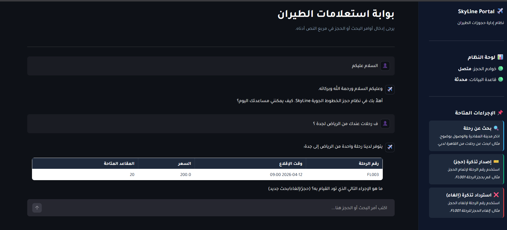
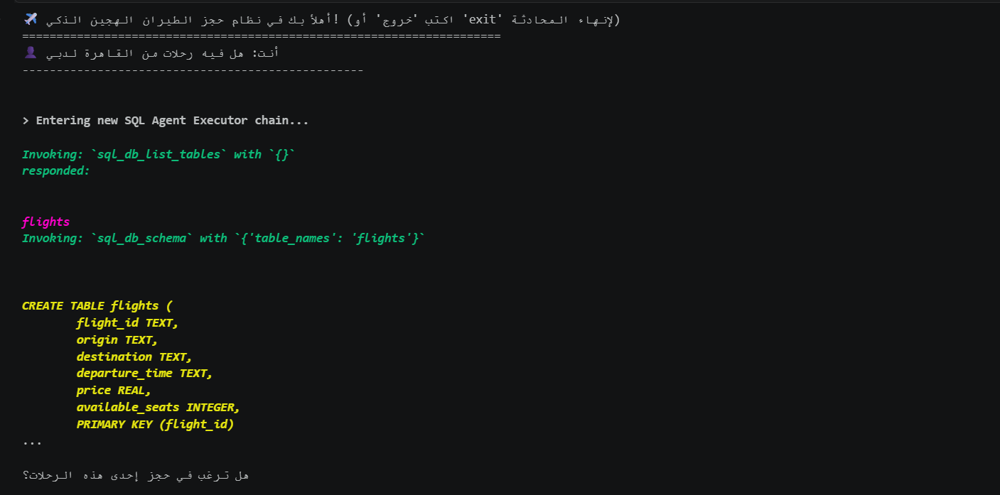
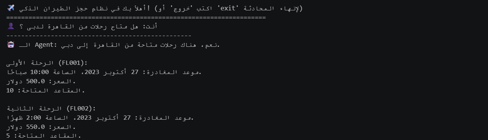
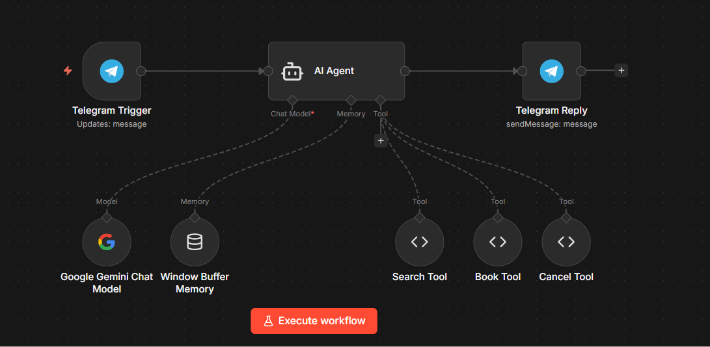

# ✈️ SkyLine: End-to-End AI Flight Booking Automation

Customer experience in the travel sector often breaks down at the booking phase. Managing flight reservations traditionally requires customers to navigate rigid, multi-step interfaces. 

This project aims to prove how AI can completely replace the traditional UI with a conversational, intelligent agent that executes transactions seamlessly. I engineered this End-to-End AI Flight Booking Automation system from scratch to evaluate different deployment strategies, testing scalability and speed to market.

---

## 🚀 Architectural Approaches

To thoroughly test the capabilities of LLMs in transactional environments, this solution was developed using distinct architectural strategies:

### 1. ⚙️ Native Code Architecture
Built a foundational AI Agent using Python and the native **Google Gemini API function calling**. The model directly queries inventory and executes bookings (Search, Book, Cancel) within a custom SQLite database via mapped Python functions.

### 2. 🧠 Hybrid SQL Framework
Engineered a programmatic approach using **LangChain SQL Agents**. This allows the AI to dynamically write SQL queries for complex searches across the database, while utilizing custom, secure tools for executing transactions (booking/canceling) without giving the LLM direct write access to the database.

### 3. 🌐 Web Deployment
Packaged the Python architecture into a clean, interactive enterprise web application deployed via **Streamlit**. It features full RTL (Right-to-Left) support, responsive design, and a real-time data table output for available flights.

### 4. ⚡ Low-Code Omnichannel
Replicated the entire core logic using **n8n**. Integrated the Gemini Chat Model with custom JavaScript tools to process reservations directly through **Telegram**, demonstrating how quickly complex operational workflows can be deployed to consumer messaging apps.

---

## 🛠️ Technology Stack

| Category | Technology | Purpose |
|----------|------------|---------|
| **LLM / AI** | Google Gemini 2.5 Flash | Core conversational intelligence |
| **Frameworks** | LangChain | SQL Agent orchestration & Tooling |
| **Web UI** | Streamlit | Enterprise web portal interface |
| **Database** | SQLite3 | Mock flight inventory & transactional storage |
| **Low-Code** | n8n | Omnichannel workflow automation |
| **Channels** | Telegram API | Consumer-facing messaging interface |
| **Languages** | Python, JavaScript (n8n tools), SQL | Backend logic and data retrieval |

---

## ✨ Key Features

* **Conversational Transactions:** Users can search, book, and cancel flights using natural language.
* **Intelligent Translation Layer:** The system inherently understands Arabic queries, translates city names to English under the hood, and queries the English database seamlessly.
* **Markdown Formatting:** Forces the AI to return flight schedules in clean, readable tables.
* **Database State Management:** Automatically updates seat availability upon booking or cancellation.
* **Read-Only SQL Agent:** Implements security best practices by restricting the LangChain SQL agent to `ro` (Read-Only) mode, forcing it to use specific tools for database updates.

---

## 🗂️ Project Structure

```text
├── app.py                         # Streamlit Web Application
├── flight_booking_agent.ipynb     # Jupyter Notebook (Native & LangChain Agents)
├── flights.db                     # SQLite Database (Auto-generates on run)
├── workflow_n8n.json              # Exported n8n workflow for Telegram bot
├── README.md                      # Project documentation
└── assets/                        # Chat screenshots and workflow diagrams
    ├── native_function_calling_chat.png
    ├── sql_agent-chat.png
    ├── web_streamlit_chat.png
    ├── workflow_n8n.png
    └── telegram_n8n_chat.jpg
````

---

## 🚀 Setup & Installation

### Prerequisites

  * Python 3.9+
  * [n8n](https://n8n.io/) (Local or Cloud instance for the Telegram bot)
  * A Google Gemini API Key
  * A Telegram Bot Token (via BotFather)

### 1\. Python Environment Setup

Clone the repository and install the required dependencies:

```bash
git clone [https://github.com/ahm7daz0uz/SkyLine-End-to-End-AI-Flight-Booking-Automation.git](https://github.com/ahm7daz0uz/SkyLine-End-to-End-AI-Flight-Booking-Automation.git)
cd SkyLine-AI-Flight-Booking
pip install streamlit google-generativeai langchain langchain-google-genai langchain-community sqlalchemy
```

### 2\. Running the Streamlit Web App

Set your Gemini API key inside `app.py` (or export it as an environment variable), then run:

```bash
streamlit run app.py
```

*The app will be available at `http://localhost:8501`*

### 3\. Running the Jupyter Notebooks

Open `flight_booking_agent.ipynb` to explore the terminal-based bots.

  * **Cell 1:** Native Gemini Function Calling Agent.
  * **Cell 2:** LangChain Hybrid SQL Agent.

### 4\. Deploying the n8n Telegram Bot

1.  Open your n8n instance.
2.  Go to **Workflows** -\> **Import from File**.
3.  Select `workflow_n8n.json`.
4.  Add your Telegram and Google Gemini credentials in the respective nodes.
5.  Activate the workflow and chat with your bot on Telegram\!

-----

## 📸 Visual Showcase: AI in Action

Below are demonstrations of the different architectural approaches in action, showing the user interface and the underlying workflow logic.

### 💻 User Interfaces (UI)

|  |  |
| :---: | :---: |
| **Approach 3: Web Deployment** (Interactive Streamlit App) | **Approach 4: Low-Code Omnichannel** (Telegram Bot via n8n) |

### 🧠 Developer Interfaces & Notebooks

|  |  |
| :---: | :---: |
| **Approach 2: Hybrid SQL Framework** (LangChain Agent Chat) | **Approach 1: Native Code Architecture** (Gemini Function Calling Chat) |

### ⚙️ Automation Workflow (n8n)

This diagram shows the complete backend logic orchestrated by n8n, connecting the Telegram user to the Gemini LLM and the transactional tools (Search, Book, Cancel).



---

## 👨‍💻 Author

For questions or support, please reach out to:

📧 Email: [ahmedazouz.contact@gmail.com](mailto:ahmedazouz.contact@gmail.com)
🐙 GitHub: [ahm7daz0uz](https://github.com/ahm7daz0uz)
💼 LinkedIn: [Ahmed Azouz](www.linkedin.com/in/ahm7daz0uz)

---
